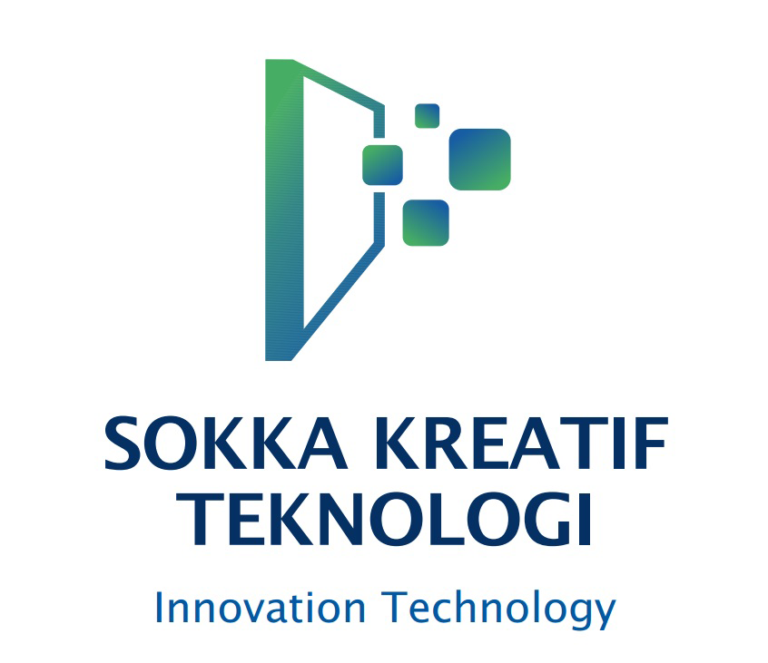

# Nexus Technology — Premium Company Profile Website

Website perusahaan premium berteknologi tinggi yang dibangun dengan **Vue 3 + Vite + Tailwind CSS v4 + GSAP + Lenis**. Kualitas visual setara Stripe, Vercel, Apple, Linear, Framer, dan Nvidia.



---

## Tech Stack

- **Vue 3** dengan Composition API (`<script setup>`)
- **Vite 6** — build tool & dev server
- **Vue Router 4** — routing
- **Tailwind CSS v4** — utility-first CSS (via `@theme` design tokens)
- **GSAP + ScrollTrigger** — animasi scroll
- **Lenis** — smooth scrolling
- **Custom Reveal System** — IntersectionObserver-based (replaces AOS for max reliability)
- **Lucide Vue Next** — icon set
- **Swiper 11** — testimonial carousel
- **CountUp** — angka statistik beranimasi (custom composable)

---

## Persyaratan Sistem

- **Node.js** v18.0+ (disarankan v20+ atau v22+)
- **npm** v9+ atau **pnpm** v8+ atau **yarn** v1.22+

Cek versi Node.js Anda:
```bash
node --version
npm --version
```

Jika belum terinstall, unduh dari https://nodejs.org/ (pilih versi LTS).

---

## Cara Install & Jalankan

### 1. Ekstrak ZIP
Ekstrak file `nexus-technology-website.zip` ke folder tujuan:
```bash
unzip nexus-technology-website.zip
cd nexus-technology-website
```

### 2. Install Dependencies
```bash
npm install
```
> Jika menggunakan pnpm: `pnpm install`
> Jika menggunakan yarn: `yarn install`

### 3. Jalankan Development Server
```bash
npm run dev
```

Buka browser ke: **http://localhost:3000/**

### 4. Build untuk Production
```bash
npm run build
```
Hasil build ada di folder `dist/`.

### 5. Preview Production Build
```bash
npm run preview
```
Buka browser ke: **http://localhost:3000/**

---

## Struktur Project

```
nexus-technology-website/
├── public/
│   └── logo.png                    # Favicon & logo statis
├── src/
│   ├── assets/
│   │   ├── images/
│   │   │   └── logo.png            # Logo utama (digunakan di seluruh app)
│   │   └── styles/
│   │       └── main.css            # Design system, Tailwind theme, utility classes
│   ├── components/
│   │   ├── base/                   # Komponen reusable
│   │   │   ├── AuroraBackground.vue
│   │   │   ├── BackToTop.vue
│   │   │   ├── CursorGlow.vue
│   │   │   ├── FloatingShapes.vue
│   │   │   ├── GlassCard.vue
│   │   │   ├── GradientButton.vue
│   │   │   ├── LoadingScreen.vue
│   │   │   ├── Navbar.vue
│   │   │   ├── ParticleField.vue
│   │   │   ├── ScrollProgress.vue
│   │   │   └── SectionHeading.vue
│   │   └── sections/               # Section halaman
│   │       ├── HeroSection.vue
│   │       ├── TrustedBySection.vue
│   │       ├── AboutSection.vue
│   │       ├── VisionMissionSection.vue
│   │       ├── ServicesSection.vue
│   │       ├── WhyChooseUsSection.vue
│   │       ├── TechnologiesSection.vue
│   │       ├── PortfolioSection.vue
│   │       ├── ProcessSection.vue
│   │       ├── TeamSection.vue
│   │       ├── TestimonialsSection.vue
│   │       ├── BlogSection.vue
│   │       ├── FAQSection.vue
│   │       ├── ContactSection.vue
│   │       └── FooterSection.vue
│   ├── composables/                # Vue composables (custom hooks)
│   │   ├── useLenis.js             # Smooth scroll
│   │   ├── useScrollReveal.js      # GSAP scroll animations
│   │   ├── useMouseParallax.js     # Mouse parallax effect
│   │   ├── useMagneticButton.js    # Magnetic button effect
│   │   ├── useCountUp.js           # Counter animation
│   │   └── useTilt.js              # 3D tilt effect
│   ├── data/
│   │   └── content.js              # SEMUA konten teks/data — edit di sini
│   ├── layouts/
│   │   └── DefaultLayout.vue       # Navbar + Footer wrapper
│   ├── pages/
│   │   └── Home.vue                # Halaman utama (compose semua section)
│   ├── router/
│   │   └── index.js
│   ├── App.vue                     # Root component + loading screen
│   └── main.js                     # Entry point
├── index.html
├── package.json
├── vite.config.js
└── README.md
```

---

## Cara Customisasi Konten

**Semua konten teks, gambar, dan data ada di satu file:**
```
src/data/content.js
```

Di file ini Anda bisa edit:
- `company` — nama, email, telepon, alamat, social media
- `trustedBy` — logo perusahaan klien
- `stats` — angka statistik (Projects, Clients, dll.)
- `services` — daftar layanan (8 layanan)
- `portfolio` — daftar portfolio (8 project)
- `team` — daftar tim (8 anggota)
- `testimonials` — daftar testimonial
- `blogPosts` — daftar artikel blog
- `faqs` — daftar FAQ
- `technologies` — daftar tech stack

### Mengganti Logo
Ganti file di kedua lokasi ini:
- `src/assets/images/logo.png` (untuk ditampilkan di website)
- `public/logo.png` (untuk favicon)

### Mengganti Warna Brand
Edit `src/assets/styles/main.css` di bagian `@theme`:
```css
@theme {
  --color-navy-700: #053063;     /* Warna utama (biru tua) */
  --color-emerald-brand-400: #46ad64;  /* Warna aksen (hijau) */
  /* ... */
}
```

### Mengganti Gambar
Project menggunakan gambar dari Unsplash CDN. Untuk mengganti dengan gambar Anda sendiri:
1. Taruh gambar di `src/assets/images/`
2. Import di component: `import myImg from '@/assets/images/my-image.jpg'`
3. Gunakan: ``

---

## Performance Notes

- ✅ Code splitting otomatis (vendor, animation, UI chunks)
- ✅ Lazy-loaded routes
- ✅ Image lazy loading
- ✅ IntersectionObserver menghentikan particle animation saat tidak terlihat
- ✅ Total gzipped JS ~140KB
- ✅ Reduced-motion support untuk accessibility

---

## Browser Support

- ✅ Chrome / Edge 90+
- ✅ Firefox 90+
- ✅ Safari 14+
- ✅ Mobile Safari (iOS 14+)
- ✅ Chrome Android

---

## Troubleshooting

### Halaman blank / konten tidak muncul
1. **Hard refresh browser**: `Ctrl+Shift+R` (Windows/Linux) atau `Cmd+Shift+R` (Mac)
2. **Buka DevTools** (`F12` atau `Cmd+Option+I`) → tab Application → Storage → "Clear site data"
3. **Disable browser cache** di DevTools → Network → checklist "Disable cache"
4. Jalankan ulang `npm run dev`

### `npm install` gagal / lambat
Coba hapus cache dan ulangi:
```bash
rm -rf node_modules package-lock.json
npm cache clean --force
npm install
```

### Port 3000 sudah dipakai
Edit `vite.config.js`, ganti `port: 3000` ke port lain (misal `5173`).

### Font tidak muncul (offline mode)
Font dimuat dari Google Fonts CDN. Jika ingin full offline, unduh font Plus Jakarta Sans, Space Grotesk, dan JetBrains Mono, lalu host lokal dan update `index.html`.

### Gambar tidak muncul
Project memuat gambar dari `images.unsplash.com`. Pastikan komputer Anda terhubung internet. Untuk full offline, ganti semua URL Unsplash dengan gambar lokal di `src/assets/images/`.

---

## License

Project ini dibuat untuk keperluan demo Nexus Technology. Bebas dimodifikasi sesuai kebutuhan.

---

**Dibangun dengan ❤️ menggunakan Vue 3 + Tailwind CSS v4**
